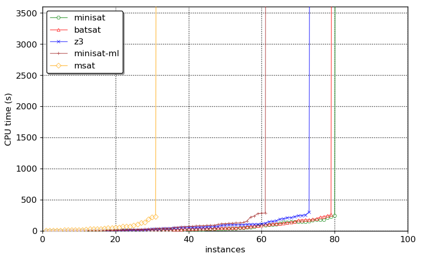
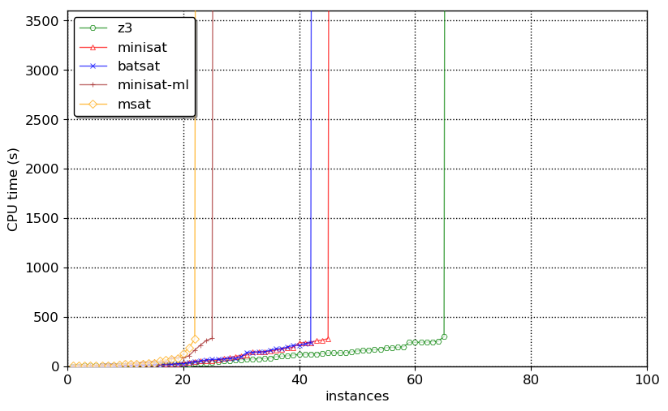
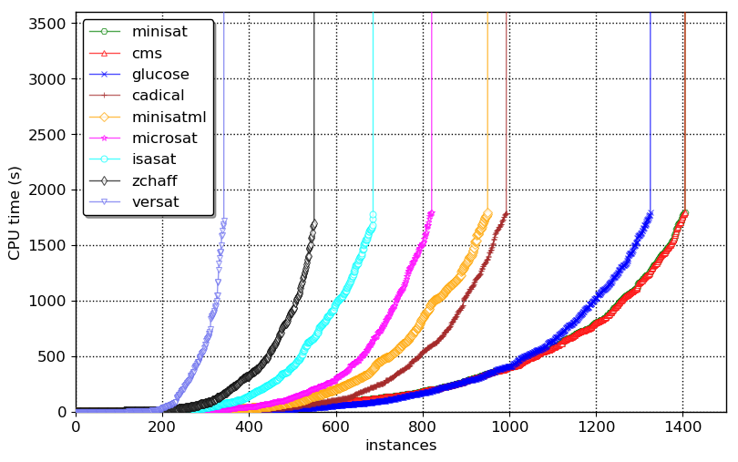
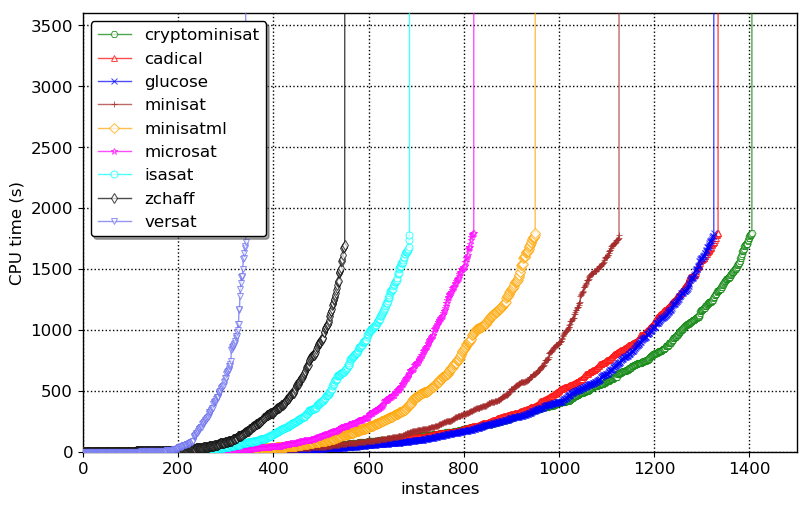

# Technical report on Minisat-ml

This is a technical report on an experiment we at [Imandra](https://imandra.ai)
have led on the comparative performance of C++, rust, and OCaml for writing
SAT solvers and similar computational logic programs. C++ is widely used
and can deliver very high performance, but is unsafe and sometimes unwieldy.
The goal of this experiment is to assess the practicality of using OCaml
(or rust) to write satisfiability solvers.

Our methodology was to adapt [Minisat 2.2](http://minisat.se)
in OCaml ([minisat-ml](https://github.com/AestheticIntegration/minisat-ml))
and in rust ([batsat](https://github.com/c-cube/batsat/),
derived from [ratsat](https://github.com/qnighy/ratsat) which is
directly adapted from Minisat), and run them on sets of benchmarks to compare
the results. Batsat is inspired from Minisat but diverged somewhat due to
its parametrization over a theory, and some internal refactorings.

We also compare with [Z3 4.8.4](https://github.com/Z3Prover/z3/releases/tag/z3-4.8.4)
and [msat](https://github.com/Gbury/mSAT/). Z3 is an alternative SMT and SAT
solver in C++. Msat is an OCaml SAT solver that is roughly inspired from Minisat
but has significant implementation differences, is functorized over a theory,
and doesn't have the same heuristic parameters.
As an OCaml codebase, its style is more idiomatic and generally more readable
than Minisat-ml.

## Implementation of Minisat-ml

The code of Minisat-ml was written in a way that closely mirrors Minisat's
source. Some differences were unavoidable due to discrepancies between OCaml
and C++.

#### Modules

Instead of `.h` and `.cpp` files, the OCaml version uses the
module system with `.ml` and `.mli` files. The `heap` file was also modified
to be parametrized (using an OCaml functor) over its content, rather than
dealing entirely with integers.
Inlining is still possible thanks to `[@@inline]` annotations on functors
and functions.

#### Imperative programming

OCaml doesn't support `return` nor `continue`/`break` in loops,
nor `do {} while()` loops.
We had to rely on exceptions to emulate the former, and tail-recursive
functions for the latter. Using OCaml 4.06 we can overload `.%[ ]` and `.%[ ] <-`
to emulate `operator[]` overloading.

Compare this fragment of conflict analysis in OCaml and C++:

```ocaml
while
  let v = Lit.var self.trail.%[ !index ] in
  index := !index -1;
  not (seen self v)
do ()
done;

p := self.trail.%[ !index+1 ];
confl := reason_lit self !p;
set_seen self (Lit.var !p) false;
pathC := !pathC - 1;
```

```cpp
while (!seen[var(trail[index--])]);
p     = trail[index+1];
confl = reason(var(p));
seen[var(p)] = 0;
pathC--;
```

In C++, the custom `Vec` type (a resizable array that is used for
almost all data in Minisat) is manipulated like an array thanks to
`operator[]` overloading.

#### Memory layout

OCaml doesn't provide value types, so we use explicit struct-of-arrays encoding
for watch lists (where the C++ version stores `struct Watcher(uint32,uint32)`
in a single vector, we have two `int Vec.t` of the same size to avoid allocating
lots of small records).

32-bit integers are replaced by 63-bit integers (on x86_64) since OCaml
only has word-sized values. Essentially, in Minisat-ml, almost everything is
a `int Vec.t` or a `foo Vec.t` where `type foo = private int` (e.g. variables
or literals or the ternary `Lbool.t`).

#### Optimizations

We use OCaml 4.06 + flambda, with the flags
`-O3 -unbox-closures -unbox-closures-factor 20`.
This allows a lot of function calls to be inlined, leading to large
performance gains.

Some functions are annotated as `[@@inline]` to guide the optimizer better.

#### Code size

The whole of minisat-ml weights 1,901 lines of OCaml
(according to David A. Wheeler's Sloccount). It implements only what's required
for the default heuristics of Minisat 2.2 (e.g. full conflict minimization).

## Experimental results

We compare solvers across a few benchmarks. The solver are:

- minisat (2.2.0, C++)
- batsat (0.2, rust)
- minisat-ml (OCaml)
- msat (0.8, OCaml)
- z3 (4.8.4, C++)

and the benchmarks are:

- `basic` (from [minisat-rust](https://github.com/mishun/minisat-rust/commit/698c40262ae84c622f048eeec6a5209103cb8188))
- [satrace '06](http://fmv.jku.at/sat-race-2006/)
- [satcomp '18](http://sat2018.forsyte.tuwien.ac.at/)

we ran these benchmarks on a machine with 20 cores 2.20GHz Intel Xeon CPUs,
and 64GB of RAM. Each solver is limited to 2GB of memory.

For each solver, we list the number of problems it solved, number of unknown,
and the total and average time spent on solved problems. This is why
sometimes a stronger solver has a higher average time, as it succeeds on some
harder benchmarks that other solvers die on.

Raw results can be found in the [snapshots](../snapshots) directory;
analysis was performed using [src/scripts/analyze.py](../src/scripts/analyze.py).

### Basic

30s timeout

| prover | sat | unsat | solved | unknown | total-time | avg-time |
|---|---|---|---|---|---|---|
| z3          | 2116 | 1103 |  3219 |  2 | 1289.1s | 0.4s  |
| msat        | 2115 | 1097 |  3212 |  9 | 1624.7s | 0.51s |
| minisat-ml  | 2118 | 1096 |  3214 |  7 | 1580.8s | 0.49s |
| minisat     | 2118 | 1102 |  3220 |  1 | 657.58s | 0.2s  |
| batsat      | 2118 | 1102 |  3220 |  1 | 846.72s | 0.26s |

### Sat-race '06

300s timeout

| prover | sat | unsat | solved | unknown | total-time | avg-time |
|---|---|---|---|---|---|---|
| z3          | 30 | 43 |  73 |  27  | 5031.7s | 68.9s |
| msat        | 11 | 20 |  31 |  69  | 1834.5s | 59.2s |
| minisat-ml  | 28 | 33 |  61 |  39  | 3866.2s | 63.4s |
| minisat     | 39 | 41 |  80 |  20  | 4092.6s | 51.2s |
| batsat      | 38 | 41 |  79 |  21  | 4443.7s | 56.2s |



### Sat-comp '18

300s timeout

| prover | sat | unsat | solved | unknown | total-time | avg-time |
|---|---|---|---|---|---|---|
| z3          | 44 | 21 | 65 |  335 | 6075.8s | 93.5s |
| msat        | 21 |  1 | 22 |  378 | 1070.8s | 48.7s |
| minisat-ml  | 23 |  2 | 25 |  375 | 1652.7s | 66.1s |
| minisat     | 37 |  8 | 45 |  355 | 3799.9s | 84.4s |
| batsat      | 34 |  8 | 42 |  358 | 3002.0s | 71.5s |



### Global evaluation (courtesy of Mathias Fleury)

[Mathias Fleury](https://www.mpi-inf.mpg.de/departments/automation-of-logic/people/mathias-fleury/)
has run a variety of SAT solvers on 3313 preprocessed problems
from SAT-comp 2009 to 2017. He ran the benchs on the MPI cluster
with 30 minute timeout and 10GB RAM per solver.

#### First Run

| prover | sat | unsat | solved | unknown | total-time | avg-time |
|---|---|---|---|---|---|---|
| isasat      | 371 |  315 |   686 | 2083 | 216087.0s |  314.996s |
| versat      | 198 |  144 |   342 | 2427 |  69745.0s |  203.933s |
| minisat     | 683 |  722 |  1405 | 1364 | 458533.0s |  326.358s |
| microsat    | 448 |  373 |   821 | 1948 | 226881.0s |  276.347s |
| cadical     | 512 |  481 |   993 | 1773 | 269024.8s |  270.921s |
| glucose     | 617 |  708 |  1325 | 1444 | 386293.0s |  291.542s |
| minisatml   | 541 |  409 |   950 | 1819 | 299271.0s |  315.022s |
| zchaff      | 311 |  239 |   550 | 2219 | 143485.0s |  260.882s |
| cms         | 683 |  722 |  1405 | 1364 | 458533.0s |  326.358s |



The solvers are:

- [isasat](https://link.springer.com/article/10.1007/s10817-018-9455-7) verified SAT solver extracted from Isabelle, in SML
- [versat](https://link.springer.com/chapter/10.1007/978-3-642-27940-9_24) a verified SAT solver
- minisat
- [microsat](https://github.com/marijnheule/microsat/) a tiny SAT solver in 200 lines of C
- [cadical](https://github.com/arminbiere/cadical/) a modern SAT solver
- [glucose](http://www.labri.fr/perso/lsimon/glucose/) a classic fork of minisat
- minisat-ml, the current work
- [zchaff](https://www.princeton.edu/~chaff/zchaff.html) one of the first advanced CDCL solvers
- [cms (cryptominisat)](https://github.com/msoos/cryptominisat) an advanced SAT solver

#### Second Run

This time with more recent versions of glucose and Cadical:

| prover      |  sat | unsat | solved | unknown | total-time | avg-time |
|---|---|---|---|---|---|---|
| isasat      |  371 |  315  |    686 |    2083 | 216087.0s  | 314.996s | 
| versat      |  198 |  144  |    342 |    2427 |  69745.0s  | 203.933s |
| minisat     |  617 |  509  |   1126 |    1643 | 324602.0s  | 288.279s |
| microsat    |  448 |  373  |    821 |    1948 | 226881.0s  | 276.347s |
| cadical     |  622 |  712  |   1334 |    1435 | 434119.4s  | 325.427s |
| glucose     |  617 |  708  |   1325 |    1444 | 386293.0s  | 291.542s |
| minisatml   |  541 |  409  |    950 |    1819 | 299271.0s  | 315.022s |
| zchaff      |  311 |  239  |    550 |    2219 | 143485.0s  | 260.882s |
| cms         |  683 |  722  |   1405 |    1364 | 458533.0s  | 326.358s |



## Discussion

The differences in performance can be explained by at least these factors:

- the write barrier, which isn't easy to elide since we use a polymorphic `'a Vec.t`
  for convenience. Specializing `Vec.t` on immediate/non-immediate types would
  certainly help here.
- more cache misses (since all data in OCaml is stored as 64-bit words on x86_64,
  whereas minisat uses more compact 32-bit integers everywhere)
- array bound checking (although we use `unsafe_get` and `unsafe_set` quite a lot)
- more arithmetic for accessing slices in the clause allocator: to get
  the `i`-th literal of a clause, we access `alloc.memory.(c + 1 + i)`.
  The clause `c` is an offset in the large integer array `alloc.memory`,
  and it points to the clause header, followed by literals.
  In contrast, the C++ version provides a local temporary struct with the header
  and a direct pointer to the first literal; subsequent accesses to literals are
  just `c.lits[i]`. Here rust shines by providing a bound-checked slice
  whose lifetime is properly limited, preventing the temporary clause struct
  from becoming stale.

The differences in behavior come from discrepancies in the VSIDS heuristics,
due to different floating point computations. At some point in non trivial
problems, variable activities in the C++ and OCaml versions diverge slightly
(after decay and renormalization, which involves a multiplication by `1e-20`),
which leads to a different variable being picked as a decision.

Msat seems to more often die of out-of-memory issues, which is not very surprising
as it was never optimized to tackle such challenging workloads — its purpose
is to serve as a CDCL(T) backend, not a pure SAT solver.

A [sample flamegraph](./perf.svg) obtained via
`./src/scripts/profile.sh _build/default/src/bin/minisat.exe benchs/basic/3bitadd_31.cnf.gz`
shows the hotspots of the OCaml code (the problem takes ~5.5s to solve).


## Notes

the graphs were generated using [Alexey Ignatiev's mkplot](https://github.com/alexeyignatiev/mkplot) script.
